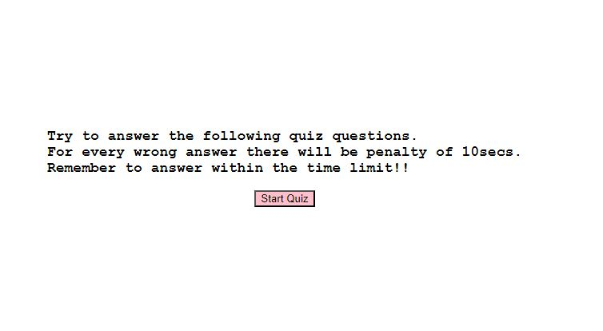
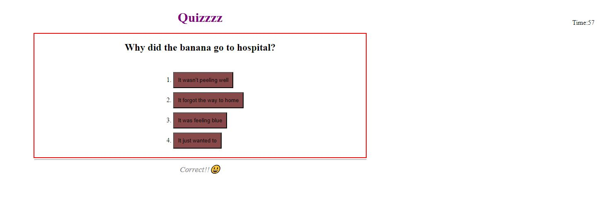
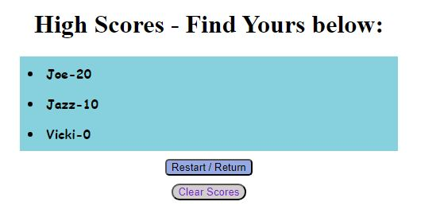

# Project--Code-Quiz

## Description
Created a Quiz for a little fun, that allows user to play the quiz and answer 4 questions within 75 seconds with a 10 seconds of penalty time for a wrong answer. Once all questions answered or time is 0, the quiz ends and it shows the score, user can enter their initial  and Submit to see other scores or even high scores. The user can restart the quiz or clear the high scores to start again.

### Built With
- HTML
- CSS
- JavaScript

### Installation
There is no installation required for this. 
Simply click on the link below and you will be taken directly to the Quiz page and start playing!

### Link: 

### Image: 
When you click on the above link, you should see a webpage similar to the image below.

